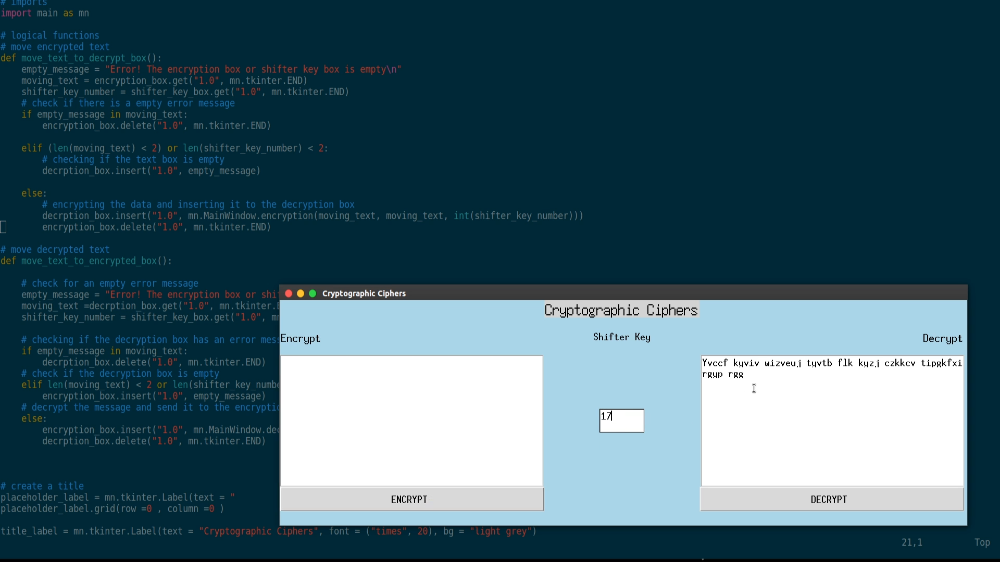

# Ciphers GUI
This project will host cryptographic ciphers in GUI format

## Screenshot

## TO-DO
- Create a window **(done)**
- Create UI elements **(done)**
- Create the Caesar encryption cipher **(done)**
- Create the Caesar decrption cipher **(done)**
- Implement the function in the UI **(done)**
- Change Main window and elements background **(done)**
- Add other ciphers e.g ROT13
- Package the program
  